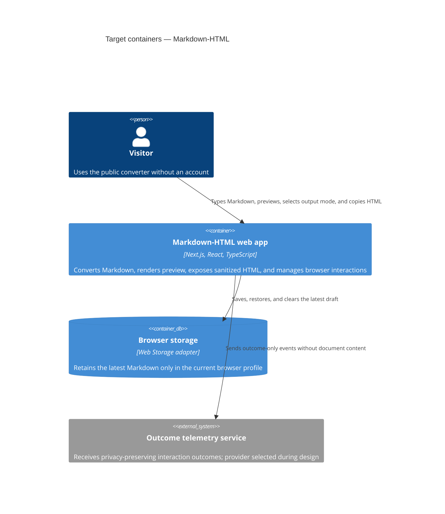

# Architecture map — Markdown-HTML

> The established greenfield foundation that the scaffold and all feature work must materialize. The repository had no commit at survey time, so `reflects_commit: UNBORN` is the explicit initial-state stamp.

## Stack

- Language / runtime: TypeScript in strict mode on Node.js LTS ([ADR-0001](./adr/0001-nextjs-typescript-frontend.md)).
- Frameworks: Next.js App Router and React, following the RexSoft frontend baseline (`/Users/obursak/Develop/rexsoft/basic-skills/.agents/skills/rexsoft-frontend/SKILL.md`).
- Package manager: pnpm; build / test / lint commands are `pnpm build`, `pnpm test`, and `pnpm lint` ([scaffold tasks](./features/_scaffold/tasks.json)).
- Styling: CSS Modules plus CSS custom-property design tokens in `src/app/globals.css` ([ADR-0002](./adr/0002-layered-frontend-architecture.md)).
- Runtime packaging: one Docker Compose `web` service; multi-stage, non-root production image with healthcheck and logging limits (`/Users/obursak/Develop/rexsoft/basic-skills/.agents/skills/rexsoft-frontend/references/devops-docker.md`).
- Datastore / migrations: none. Draft persistence is browser-only ([ADR-0003](./adr/0003-browser-only-persistence.md)).

## C4 — target foundation

## Module inventory

| Module | Path | Layers | Wired at | Responsibility |
|---|---|---|---|---|
| Route shell | `src/app/` | app | `src/app/page.tsx` | Metadata, layout, route composition, and the Server-to-Client boundary |
| Conversion domain | `src/entities/conversion/` | entities | `src/view/widgets/ConverterWidget/` | Typed Markdown, sanitization, output-mode, and conversion-result contracts |
| Shared foundation | `src/shared/` | shared | `src/app/globals.css` and direct lower-layer imports | Domain-neutral UI primitives, hooks, browser adapters, utilities, tokens, and styles |
| Converter UI | `src/view/` | view | `src/view/widgets/ConverterWidget/` | Product-specific editor, preview, HTML output, notices, and copy workflow |
| Providers | `src/providers/` | providers | `src/app/layout.tsx` | Application-wide providers only when a concrete need appears |
| Data adapters | `src/data/` | data | feature-specific imports | External telemetry adapter only; omitted until a provider is selected |

## Conventions

- **Module wiring / registration:** thin `app/` routes compose `view/` widgets and providers; dependencies flow `app → view/data/entities/shared`, never upward ([ADR-0002](./adr/0002-layered-frontend-architecture.md)).
- **Error handling:** expected browser failures become typed results and visible UI states; unexpected failures use route/widget error boundaries ([scaffold tasks](./features/_scaffold/tasks.json)).
- **IDs:** no persisted domain IDs in the MVP; telemetry may use only a random tab-scoped session identifier ([feature spec](./features/markdown-to-html/spec.md)).
- **Persistence / DB access:** browser storage sits behind a typed adapter with session-only fallback; there is no database ([ADR-0003](./adr/0003-browser-only-persistence.md)).
- **Migrations:** N/A — no database or migration tool is part of the foundation ([ADR-0003](./adr/0003-browser-only-persistence.md)).
- **Tests:** unit tests cover pure conversion/security contracts, component tests cover interaction states, and browser E2E covers preview/copy/storage/accessibility ([scaffold tasks](./features/_scaffold/tasks.json)).
- **Inter-module communication:** typed function/component contracts inside one frontend deployment; outcome telemetry uses an adapter boundary selected during design ([ADR-0002](./adr/0002-layered-frontend-architecture.md)).
- **UI / styling:** CSS Modules for component styles and CSS custom properties for tokens; raw color values do not appear outside the token source (`/Users/obursak/Develop/rexsoft/basic-skills/.agents/skills/rexsoft-frontend/references/onboarding.md`).

## Datastores

| Store | Engine | Accessed via | Notes |
|---|---|---|---|
| Latest draft | Browser storage | Typed persistence adapter in `src/shared/` | Current browser profile only; session fallback on denial/quota failure; no server copy |

## Frontend / UI foundation

- **Component library / design system:** in-repo primitives under `src/shared/ui/`; no third-party kit is selected by survey.
- **Design tokens:** CSS custom properties in `src/app/globals.css`; concrete colors, spacing, and typography remain `UNKNOWN` until a design source is approved.
- **Styling approach:** CSS Modules with camelCase class names; responsive breakpoints at `≤768px` and `≤1024px` (`/Users/obursak/Develop/rexsoft/basic-skills/.agents/skills/rexsoft-frontend/references/onboarding.md`).
- **Shared primitives:** scaffold establishes only primitives proven necessary by the converter; it does not invent a general component library.
- **State / data-fetching:** local React state plus typed browser adapters; no server-cache library without a concrete integration.
- **Closest UI precedent:** none in this greenfield repository; design must establish the first precedent from an explicit design source.

## Where things live / closest precedents

- A new route → `src/app/`, kept thin and composed from `src/view/` ([ADR-0002](./adr/0002-layered-frontend-architecture.md)).
- A new domain-neutral primitive → `src/shared/ui/`; a converter-specific component → `src/view/components/` or `src/view/widgets/`.
- Conversion and sanitization contracts → `src/entities/conversion/`; browser persistence → `src/shared/` adapter.
- No shipped feature precedent exists yet; the Markdown converter becomes the first precedent after implementation.

## Constraints & known tech-debt

- No backend, database, accounts, or cross-device sync may be introduced without reclassifying the feature and recording a new ADR.
- Raw HTML must never be interpreted as markup; preview, displayed HTML, and copied rich HTML derive from one sanitized structure ([feature spec](./features/markdown-to-html/spec.md)).
- The live design source and concrete design-token values are unresolved; implementation must not fabricate them.
- The telemetry provider is unresolved, but its adapter must enforce the spec's content-exclusion and retention rules.
- The RexSoft baseline contains generic backend/API guidance that is N/A here; only frontend-applicable rules are adopted.

## Reconciliation with the authored architecture doc

No authored architecture document existed. This map establishes the target foundation and reconciles the accepted feature spec with the RexSoft frontend baseline.
