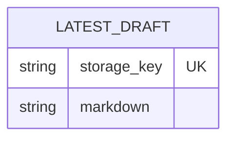

# Data model — markdown-to-html

This feature has no database schema. Its sole persisted value is the latest Markdown draft in the current browser profile's `localStorage`, with current-tab memory as a non-persistent fallback. The accepted architecture explicitly excludes a backend, database, migration tool, server-side document identity, and cross-device persistence.

## ER diagram

`LATEST_DRAFT` is a logical browser-storage record, not a relational table. It documents the value touched by the restore, retain, and clear flows without implying a database schema.

## Entities

### `latest_draft`

| Column | Type | Constraints | Notes |
|---|---|---|---|
| `storage_key` | string | Constant, unique within the application origin | Adapter-owned key used to read, replace, and remove the one retained draft; it is not a persistent domain identifier |
| `markdown` | string | Latest completed input only; confidential | Stored in the current browser profile within the 500 ms autosave window; never sent to telemetry |

**Aggregate root:** `latest_draft` is the root and the complete browser-persistence aggregate. No child entities or foreign keys exist.

**Access patterns:** read the single value when the converter opens; replace it after completed input; remove it when the Visitor chooses Clear. The Web Storage API resolves these operations directly by `storage_key`, so no application-defined index exists.

**Constraints:** the typed adapter owns one well-known key and replaces its value atomically at the Web Storage API boundary. When browser profile storage is unavailable or fails, the same logical value is retained only in current-tab memory and a warning remains visible.

## Indexes

| Index | Columns | Query it serves |
|---|---|---|
| N/A | N/A | Restore, retain, and clear use direct Web Storage key access; there is no database index to create |

## Test fixtures

- `createDraftStorageHarness(...)` — planned browser-adapter test harness for an empty store, one retained Markdown value, denied/quota-failed writes, and failed deletion. Fixture content must be synthetic and must not resemble personal data.

## Migration impact

No schema change exists: no entity, column, constraint, or database index is added or changed. Consequently this stage produces zero staged SQL migrations and does not create or modify any live migration tree.
