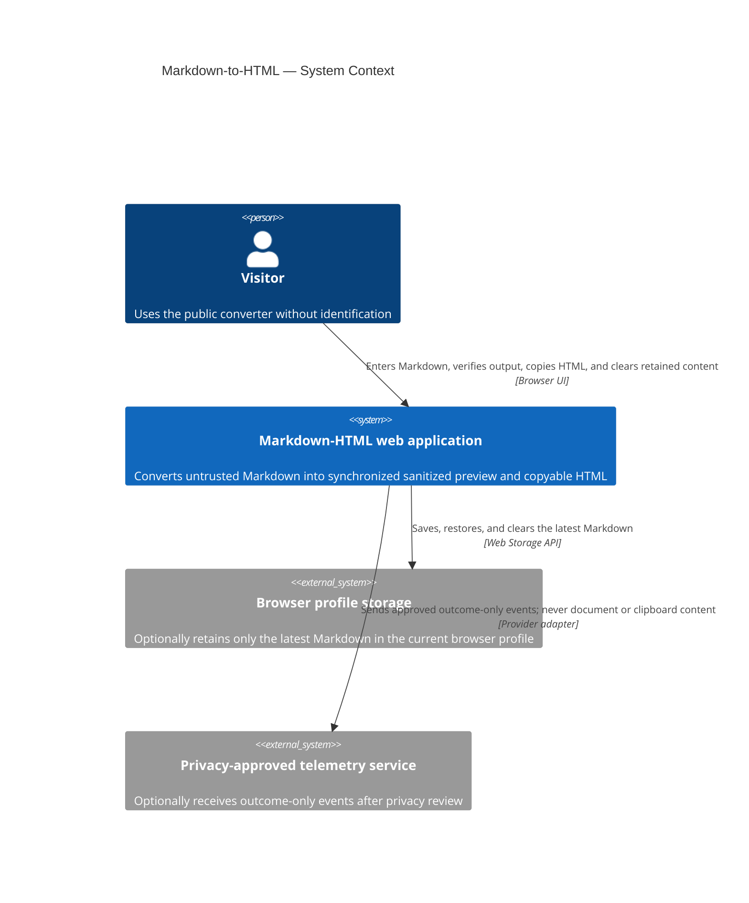

# Software Architecture Document — markdown-to-html

<!-- 12 Arc42 sections. Empty section → N/A with a one-line reason. -->
<!-- C4 Context (L1) lives inline in §3. C4 Container (L2) lives inline in §5. -->
<!-- Numbers in §10 come verbatim from spec.md §6 NFR. -->

## 1. Introduction and goals

**Intent.** Build a public, browser-only web converter where a Visitor enters Markdown and receives a synchronized, sanitized preview and copyable HTML without an account or server-side document storage.

**Top-3 quality goals:**

1. **Safety and privacy.** Active content must never execute; document content must remain in the Visitor's browser and outside telemetry.
2. **Output correctness.** Preview, displayed HTML, and clipboard output must derive from the same normalized sanitized structure.
3. **Responsive, recoverable interaction.** Conversion must meet the specified latency target, preserve completed input locally, expose failures, and remain keyboard-accessible.

**Stakeholders.**

| Role | Interest | Sign-off owner? |
|---|---|---|
| Visitor | Converts Markdown, verifies the result, copies HTML, and controls locally retained content | No |
| Product Owner | Product intent, scope, and acceptance | Yes — product scope |
| Tech Lead | Architecture and implementation boundaries | Yes — architecture |
| Security Lead | Rendering, sanitization, clipboard, persistence, and telemetry controls | Yes — security |

<!-- Decision overrides: none. -->

## 2. Constraints

**Technical.**

- Node.js ≥22, pnpm 11.5.2, strict TypeScript 6.x, Next.js App Router 16.3.0, and React 19.x.
- One browser-focused frontend; no backend, database, migrations, accounts, or cross-device storage.
- Server Components by default, with a narrow Client Component boundary for the interactive converter and browser APIs.

**Organisational.**

- Feature size S on the quick pipeline route.
- No authoritative deadline, person-week budget, or team composition is recorded; this SAD does not invent them.

**Conventions.**

- Follow [AGENTS.md](../../../AGENTS.md), [the architecture map](../../architecture-map.md), and the installed RexSoft frontend skill.
- Dependencies flow `app → view/data/entities/shared`, never upward. Routes stay thin; conversion and sanitization stay outside React components; browser integrations use typed adapters.
- Use CSS Modules and existing CSS custom properties. Preserve unresolved design-source and visual-token `<!-- FILL -->` markers until an authoritative source exists.

**Regulatory / external.**

- Treat entered Markdown as confidential. Raw Markdown HTML is escaped as text; preview, displayed source, and copied rich HTML share one sanitized representation.
- Keep Markdown, generated HTML, clipboard content, document URLs, and persistent identifiers out of telemetry.
- Production telemetry remains disabled until its provider and exact event subset pass privacy review.

## 3. Context and scope

The Markdown-HTML web application gives a Visitor one public, no-login workflow for converting untrusted Markdown into synchronized, sanitized preview and copyable HTML. Conversion and retention remain in the browser; the system has no backend, identity provider, document API, database, or cross-device data boundary. All Markdown is untrusted at entry, while any future telemetry boundary accepts outcome metadata only.

<!-- brownfield: the target foundation has been materialized as a minimal Next.js scaffold; converter domain, browser adapters, and product UI are not implemented yet. -->

**External systems (in / out):**

| Actor or system | Type | Interaction |
|---|---|---|
| Visitor | Person | Enters Markdown, verifies preview and HTML, selects an output mode, copies output, and clears retained content |
| Browser profile storage | Browser capability | Retains only the latest Markdown when available; may deny or fail writes |
| Privacy-approved telemetry service | External system, optional | Receives only an approved subset of outcome metadata after provider privacy review |

**C4 Context (L1):**

## 4. Solution strategy

1. **One web-frontend target surface.** The feature is one public browser experience. It introduces no backend service, worker service, mobile or desktop application, CLI, or SDK.
2. **Server-rendered shell around one client converter.** App Router owns the static route shell and metadata; a narrow Client Component owns editor state and browser interactions. Local React state is sufficient, so no global state library is introduced. See [ADR-0001](./adr/0001-keep-the-route-shell-server-rendered-around-one-client-converter.md).
3. **One canonical sanitized conversion result.** A pure typed pipeline parses full GFM while treating raw HTML as text, normalizes the structure, applies the output security policy, records content-free transformation diagnostics, and serializes every presentation from the same result. See [ADR-0002](./adr/0002-derive-every-output-from-one-sanitized-conversion-result.md).
4. **Revision-matched freshness.** Each completed input or composition event advances a revision. Preview and displayed HTML update together, while copy remains disabled until both the input revision and output mode match the latest request. Conversion begins on the browser main thread; boundary performance tests trigger a Web Worker follow-up if required. See [ADR-0003](./adr/0003-gate-copying-with-revision-matched-conversion-results.md).
5. **Typed browser integration boundaries.** Persistence owns `localStorage`, current-tab memory fallback, restoration, and clearing. A provider-neutral telemetry port defaults to disabled until privacy approval and cannot accept document or clipboard data. See [ADR-0004](./adr/0004-isolate-browser-persistence-and-telemetry-behind-typed-adapters.md).

## 5. Building block view

<!-- Internal decomposition and one C4 container per declared target surface. -->

## 6. Runtime view

<!-- At least one critical semantic sequence flow using §5 participants. -->

## 7. Deployment view

<!-- Topology, monitoring, and scaling thresholds, or reasoned N/A for S. -->

## 8. Crosscutting concepts

<!-- Cross-module security, errors, persistence, telemetry, accessibility, and related conventions. -->

## 9. Architecture decisions

<!-- Reverse index of all feature ADRs. -->

## 10. Quality requirements

<!-- Testable When/Then/How-verify scenarios using spec §6 figures verbatim. -->

## 11. Risks and technical debt

<!-- Risks, accepted debt, and every deferred decision with mandatory owner and due. -->

## 12. Glossary

<!-- Canonical domain and technical terms; feature CONTEXT wins on conflicts. -->
