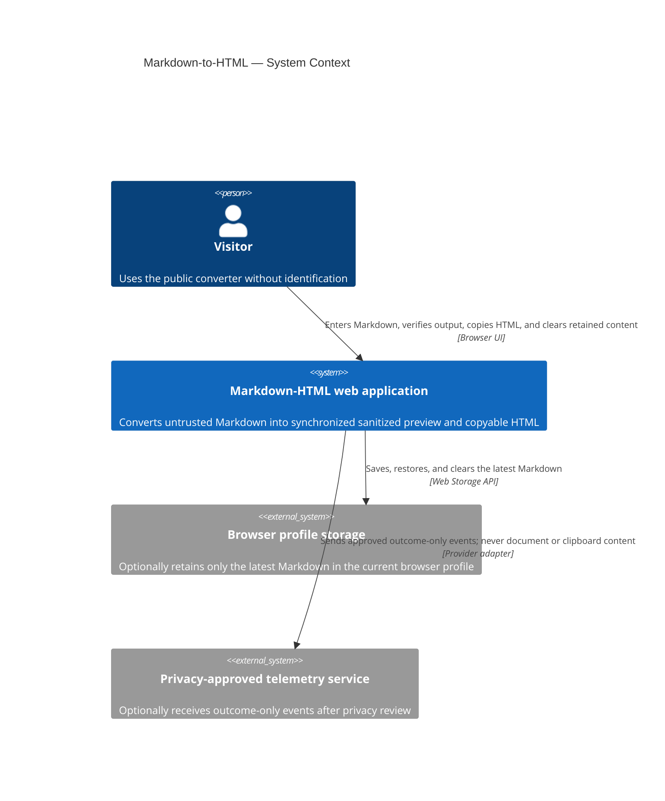
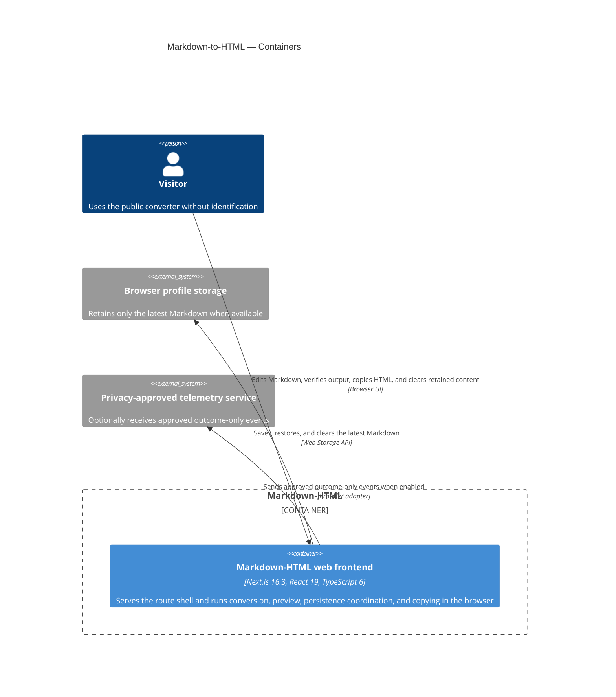
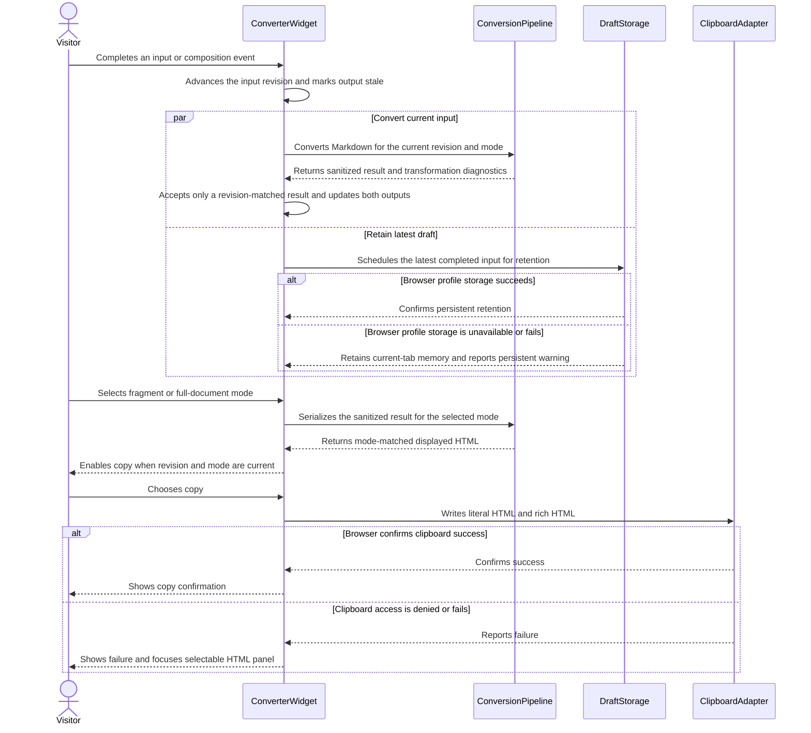

# Software Architecture Document — markdown-to-html

<!-- 12 Arc42 sections. Empty section → N/A with a one-line reason. -->
<!-- C4 Context (L1) lives inline in §3. C4 Container (L2) lives inline in §5. -->
<!-- Numbers in §10 come verbatim from spec.md §6 NFR. -->

## 1. Introduction and goals

**Intent.** Build a public, browser-only web converter where a Visitor enters Markdown and receives a synchronized, sanitized preview and copyable HTML without an account or server-side document storage.

**Top-3 quality goals:**

1. **Safety and privacy.** Active content must never execute; document content must remain in the Visitor's browser and outside telemetry.
2. **Output correctness.** Preview, displayed HTML, and clipboard output must derive from the same normalized sanitized structure.
3. **Responsive, recoverable interaction.** Conversion must meet the specified latency target, preserve completed input locally, expose failures, and remain keyboard-accessible.

**Stakeholders.**

| Role | Interest | Sign-off owner? |
|---|---|---|
| Visitor | Converts Markdown, verifies the result, copies HTML, and controls locally retained content | No |
| Product Owner | Product intent, scope, and acceptance | Yes — product scope |
| Tech Lead | Architecture and implementation boundaries | Yes — architecture |
| Security Lead | Rendering, sanitization, clipboard, persistence, and telemetry controls | Yes — security |

<!-- Decision overrides: none. -->

## 2. Constraints

**Technical.**

- Node.js ≥22, pnpm 11.5.2, strict TypeScript 6.x, Next.js App Router 16.3.0, and React 19.x.
- One browser-focused frontend; no backend, database, migrations, accounts, or cross-device storage.
- Server Components by default, with a narrow Client Component boundary for the interactive converter and browser APIs.

**Organisational.**

- Feature size S on the quick pipeline route.
- No authoritative deadline, person-week budget, or team composition is recorded; this SAD does not invent them.

**Conventions.**

- Follow [AGENTS.md](../../../AGENTS.md), [the architecture map](../../architecture-map.md), and the installed RexSoft frontend skill.
- Dependencies flow `app → view/data/entities/shared`, never upward. Routes stay thin; conversion and sanitization stay outside React components; browser integrations use typed adapters.
- Use CSS Modules and existing CSS custom properties. Preserve unresolved design-source and visual-token `<!-- FILL -->` markers until an authoritative source exists.

**Regulatory / external.**

- Treat entered Markdown as confidential. Raw Markdown HTML is escaped as text; preview, displayed source, and copied rich HTML share one sanitized representation.
- Keep Markdown, generated HTML, clipboard content, document URLs, and persistent identifiers out of telemetry.
- Production telemetry remains disabled until its provider and exact event subset pass privacy review.

## 3. Context and scope

The Markdown-HTML web application gives a Visitor one public, no-login workflow for converting untrusted Markdown into synchronized, sanitized preview and copyable HTML. Conversion and retention remain in the browser; the system has no backend, identity provider, document API, database, or cross-device data boundary. All Markdown is untrusted at entry, while any future telemetry boundary accepts outcome metadata only.

<!-- brownfield: the target foundation has been materialized as a minimal Next.js scaffold; converter domain, browser adapters, and product UI are not implemented yet. -->

**External systems (in / out):**

| Actor or system | Type | Interaction |
|---|---|---|
| Visitor | Person | Enters Markdown, verifies preview and HTML, selects an output mode, copies output, and clears retained content |
| Browser profile storage | Browser capability | Retains only the latest Markdown when available; may deny or fail writes |
| Privacy-approved telemetry service | External system, optional | Receives only an approved subset of outcome metadata after provider privacy review |

**C4 Context (L1):**



## 4. Solution strategy

1. **One web-frontend target surface.** The feature is one public browser experience. It introduces no backend service, worker service, mobile or desktop application, CLI, or SDK.
2. **Server-rendered shell around one client converter.** App Router owns the static route shell and metadata; a narrow Client Component owns editor state and browser interactions. Local React state is sufficient, so no global state library is introduced. See [ADR-0001](./adr/0001-keep-the-route-shell-server-rendered-around-one-client-converter.md).
3. **One canonical sanitized conversion result.** A pure typed pipeline parses full GFM while treating raw HTML as text, normalizes the structure, applies the output security policy, records content-free transformation diagnostics, and serializes every presentation from the same result. See [ADR-0002](./adr/0002-derive-every-output-from-one-sanitized-conversion-result.md).
4. **Revision-matched freshness.** Each completed input or composition event advances a revision. Preview and displayed HTML update together, while copy remains disabled until both the input revision and output mode match the latest request. Conversion begins on the browser main thread; boundary performance tests trigger a Web Worker follow-up if required. See [ADR-0003](./adr/0003-gate-copying-with-revision-matched-conversion-results.md).
5. **Typed browser integration boundaries.** Persistence owns `localStorage`, current-tab memory fallback, restoration, and clearing. A provider-neutral telemetry port defaults to disabled until privacy approval and cannot accept document or clipboard data. See [ADR-0004](./adr/0004-isolate-browser-persistence-and-telemetry-behind-typed-adapters.md).

## 5. Building block view

The feature uses the accepted layered frontend architecture. One web container owns delivery and browser execution, while pure conversion contracts, browser adapters, external telemetry integration, and product UI have distinct module ownership. Dependencies flow `app → view/data/entities/shared`; lower layers never import upward.

**Internal decomposition:**

```text
src/
├── app/
│   └── page.tsx                         thin server-rendered route composition
├── entities/conversion/
│   ├── types.ts                         revisions, modes, sanitized nodes, diagnostics
│   ├── parse.ts                         GFM parsing with raw HTML treated as text
│   ├── sanitize.ts                      URL/structure policy and transformations
│   ├── serialize.ts                     fragment and minimal-document serializers
│   └── convert.ts                       pure pipeline orchestration
├── data/telemetry/
│   ├── types.ts                         approved outcome-only event contract
│   ├── disabledTelemetry.ts             default implementation
│   └── providerAdapter.ts               added only after privacy approval
├── shared/
│   ├── browser/draftStorage.ts          localStorage plus tab-memory fallback
│   ├── browser/clipboard.ts             dual-MIME copy adapter
│   └── ui/                              domain-neutral primitives only
└── view/
    ├── components/                      editor, preview, HTML, notices, controls
    └── widgets/ConverterWidget/         interaction state and feature composition
```

The converter widget coordinates the workflow but does not implement parsing, sanitization, persistence, or clipboard policy. No application-wide provider is introduced.

**C4 Container (L2):**



## 6. Runtime view

**Critical flow 1: Convert, retain, select output mode, and copy**



The downstream `sequences` stage expands this seed so every acceptance criterion maps to a flow, branch, or explicit N/A.

## 7. Deployment view

<!-- N/A: This S-sized feature reuses the existing single non-root Docker Compose `web` service, standalone Next.js output, port 3000, healthcheck, and bounded container logs. It adds no runtime service, datastore, queue, worker, replica policy, or infrastructure scaling threshold. Browser performance and outcome monitoring belong in §8 and §10 rather than creating deployment topology. -->

## 8. Crosscutting concepts

| Concept | Convention | Where defined |
|---|---|---|
| Input trust | Treat every Markdown character as untrusted; raw HTML becomes text before it can affect structure | Spec §6.1; ADR-0002 |
| Output security | Allow structure only from supported GFM; centralize URL/image policy and content-free diagnostics in the conversion domain | Spec AC-05/AC-05b; ADR-0002 |
| Output consistency | Preview, displayed HTML, and clipboard payloads consume one revision- and mode-identified sanitized result | Spec AC-03/AC-09; ADR-0002/ADR-0003 |
| Error handling | Expected browser failures return typed results and visible recoverable states; unexpected widget/route failures use React/Next error boundaries | Architecture map; ADR-0004 |
| Persistence | Save completed input within 500 ms; fall back to current-tab memory with a persistent warning; Clear removes both copies | Spec AC-06–AC-08; ADR-0004 |
| Clipboard | Write `text/plain` and `text/html` together; confirm only after browser success; focus the selectable HTML panel on failure | Spec AC-04/AC-04b; ADR-0003 |
| Telemetry and logging | Allowlisted outcome fields only; never document, output, clipboard, URL, excerpt, or persistent identifier content | Spec §6.1; ADR-0004 |
| Accessibility | Keyboard operation and focus management are component contracts, including failure paths and notices | Spec §6 Accessibility; here |
| Internationalization | N/A for MVP because no locale or translation requirement is approved; accessible copy remains centralized for later extraction | Here |
| Authentication and IDs | N/A: no account or authorization boundary; only a random tab-scoped telemetry session identifier may exist after approval | Spec §6.1; architecture map |

## 9. Architecture decisions

| # | Title | Status | Section |
|---|---|---|---|
| 0001 | Keep the route shell server-rendered around one client converter | Accepted | §4 |
| 0002 | Derive every output from one sanitized conversion result | Accepted | §4 |
| 0003 | Gate copying with revision-matched conversion results | Accepted | §4 |
| 0004 | Isolate browser persistence and telemetry behind typed adapters | Accepted | §4 |

ADR files live under `docs/features/markdown-to-html/adr/NNNN-<decision-title>.md`.

## 10. Quality requirements

**QG-1. Safety and privacy**

- **When:** Known unsafe fixtures are converted and consumed through preview or either clipboard representation.
- **Then:** 100% of known unsafe fixtures execute no active content in preview or copied HTML.
- **How verify:** Security regression suite across allowed and disallowed elements, attributes, URL schemes, images, raw HTML, and both clipboard representations.

**QG-2. Output correctness**

- **When:** Sequential editing, output-mode switching, and copying occur.
- **Then:** 100% of successful copy operations contain the current visible sanitized HTML as both literal source and rich HTML.
- **How verify:** Integration tests that also attempt copying during stale input revisions and output-mode changes.

**QG-3a. Live responsiveness**

- **When:** Documents up to 100,000 Unicode code points are converted.
- **Then:** Live conversion latency is p95 ≤100 ms.
- **How verify:** Automated browser performance tests across boundary sizes counted as Unicode code points.

**QG-3b. Initial usability**

- **When:** The application loads with cold cache on a 4-core, 4 GB mobile profile over 10 Mbps downlink and 100 ms network latency.
- **Then:** Input is available and both output panels are initialized at p95 ≤2 s.
- **How verify:** Synthetic browser test.

**QG-3c. Draft recovery**

- **When:** Input is older than 500 ms, or browser profile storage is unavailable or fails.
- **Then:** The latest input is restored from `localStorage` in normal browsing mode; any storage write failure produces retention only in current-tab memory and a persistent warning.
- **How verify:** Browser integration tests in normal mode across the browser support matrix, plus private-mode and forced-storage-failure cases.

**QG-3d. Accessibility**

- **When:** A Visitor uses the primary workflow, including copy failure, notices, output-mode switching, and Clear.
- **Then:** All primary actions work from the keyboard; zero critical or serious violations.
- **How verify:** Automated accessibility scan and keyboard smoke test.

## 11. Risks and technical debt

| Risk / debt | Severity | Mitigation | Owner |
|---|---|---|---|
| A GFM parser may not preserve the source positions needed for every sanitization transformation | High | Evaluate representative fixtures before adoption; reject dependencies that cannot support full GFM plus positional diagnostics | Tech Lead |
| Browser clipboard implementations may differ for dual `text/plain` and `text/html` writes | Medium | Test the declared browser matrix and retain the selectable-panel fallback | Tech Lead |
| Main-thread conversion may miss responsiveness targets near 100,000 code points | Medium | Run boundary tests early; preserve the revision protocol when moving conversion to a Web Worker | Tech Lead |
| Live design source and concrete product tokens are unresolved | Medium | Preserve `<!-- FILL -->` markers and avoid fabricated values until an authoritative source is approved | Product Owner |
| Telemetry provider and approved event subset are unresolved | Open question | Resolve before production launch; launch remains blocked until privacy review passes | Product Owner + Tech Lead |
| Local version history rules are unresolved | Open question | Resolve before specifying version history; MVP retains only the latest draft | Product Owner |

**Accepted debt (acceptable in v1, revisit at the stated trigger):**

- Conversion begins on the main thread; boundary performance evidence determines whether to introduce a Web Worker.
- Only the latest draft is retained; there is no local version history.
- Telemetry remains disabled until its provider and event subset are approved.
- The initial UI uses only established tokens and cannot claim fidelity to a missing design source.

## 12. Glossary

| Term | Meaning |
|---|---|
| Visitor | A person who uses the public converter without identification; not a registered user and has no server-side profile |
| GFM | The full official GitHub Flavored Markdown syntax supported by the converter |
| Sanitized conversion result | The normalized, typed structure remaining after security policy is applied; every visible and copied output derives from it |
| Transformation diagnostic | A content-free record of a removal, change, or escaped raw-HTML occurrence, including category and source position but no input excerpt |
| Fragment mode | The default output containing only converted content |
| Full-document mode | The same converted content inside the strictly minimal wrapper defined by AC-09 |
| Current result | A result whose input revision and output mode both match the Visitor's latest state |
| Browser profile storage | `localStorage` scoped to the current browser profile; not a server datastore |
| Current-tab memory | A non-persistent fallback retained only while the current tab remains alive |
| Clear | The action that removes editor input and every application-controlled copy from browser profile storage and current-tab memory |
