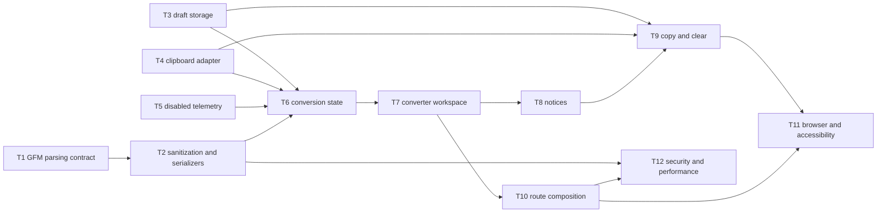

# Epic — markdown-to-html

> **Spec:** [spec.md](../spec.md) · **Design:** [sad.md](../sad.md) · **Data model:** [data-model.md](../data-model.md) · **API:** [N/A report](../contracts/api-sync-report.md) · **ADRs:** [adr/](../adr/)

## Goal

Deliver the browser-only workflow in [spec §2](../spec.md#2-goals): live full-GFM conversion, synchronized safe preview and HTML, confirmed copying, and Visitor-controlled local retention. The implementation follows the single client-island and canonical sanitized-result boundaries in [sad §5–§6](../sad.md#5-building-block-view).

## Scope

- **In:** Conversion contracts, sanitization, deterministic serialization, browser storage and clipboard adapters, disabled telemetry, converter interaction state, semantic UI, route composition, and quality-gate tests.
- **Out:** Backend services, databases, accounts, cross-device sync, publishing, downloads, custom templates or styles, version history, and a production telemetry provider.

## Task map

## Tasks

See [tracker.md](./tracker.md) for status. Machine contract: [tasks.json](../tasks.json).

| # | Task | Layer | Blocked by | DoD (short) |
|---|---|---|---|---|
| T1 | Establish the typed GFM parsing contract | domain | — | Parser tests prove GFM, positions, and inert raw HTML. |
| T2 | Implement canonical sanitization and deterministic serializers | domain | T1 | Security and serializer tests prove policy and output equivalence. |
| T3 | Add resilient latest-draft browser storage | infra | — | Adapter tests prove restore, fallback, isolation, and Clear. |
| T4 | Add a typed dual-MIME clipboard adapter | infra | — | Adapter tests prove identical MIME payloads and typed failures. |
| T5 | Define disabled-by-default outcome telemetry | infra | — | Contract tests prove disabled emission and content exclusion. |
| T6 | Coordinate revision-matched conversion state | app | T2, T3, T4, T5 | State tests prove freshness, composition, restore, and size gates. |
| T7 | Build the semantic converter workspace | ui | T6 | Component tests prove synchronized, keyboard-operable panels. |
| T8 | Expose sanitization and retention notices | ui | T7 | Component tests prove safe details and persistent warnings. |
| T9 | Complete copy and clear interaction recovery | ui | T3, T4, T8 | Component tests prove success, fallback focus, freshness, and Clear. |
| T10 | Compose the server-rendered converter route | wiring | T7 | Route tests prove the thin server shell and token-based styling. |
| T11 | Verify the complete browser workflow and accessibility | tests | T9, T10 | Browser workflows and accessibility checks pass. |
| T12 | Prove security and performance quality gates | tests | T2, T10 | Browser security and measured performance gates pass. |

## Risks / Hard rules

- Treat every Markdown character as untrusted; preview, displayed HTML, and copied rich HTML must derive from one sanitized result ([spec §6.1](../spec.md#61-security--privacy), [ADR-0002](../adr/0002-derive-every-output-from-one-sanitized-conversion-result.md)).
- Never place Markdown, generated HTML, clipboard content, document URLs, excerpts, or persistent identifiers in telemetry ([ADR-0004](../adr/0004-isolate-browser-persistence-and-telemetry-behind-typed-adapters.md)).
- Keep route files thin and dependencies flowing `app → view/data/entities/shared`; browser interactions remain inside the narrow client boundary ([ADR-0001](../adr/0001-keep-the-route-shell-server-rendered-around-one-client-converter.md)).
- Copy remains unavailable unless input revision and output mode are current ([ADR-0003](../adr/0003-gate-copying-with-revision-matched-conversion-results.md)).
- Reuse CSS Modules, the existing global tokens, native semantic controls, and the scaffold skip link. The live design source and product token values remain unresolved, so no task may fabricate them.

